
<h1 align="center">基于Java的众惠商城的设计与实现+vue</h1>

## 简介
众惠商城：角色分为管理员、用户；功能包括商品管理、用户中心、订单管理、公告信息、论坛交流，实现便捷的购物体验与高效的后台管理。    --计算机毕业设计源码；毕设源码；java毕业设计源码

## 联系方式

<h3 align="center">获取完整代码与数据库文件 + 微信：deepguan QQ: 86050149 QQ群: 783742310</h3>

<h3 align="center">可帮忙远程部署 包运行成功！提供远程部署、修改代码、设计文档指导、代码讲解等服务！</h3>

## 功能介绍（完整见运行截图）
管理员：基本功能包括登录、注册和退出。用户可以访问网站首页，其中包含导航栏、公告信息、论坛、商品推荐等，同时可以通过商品管理模块查看和操作商品信息，管理包括创建、修改、查询和上架/下架商品。订单管理允许查看和处理用户订单及物流信息。用户管理、公告管理和评价管理帮助管理员维护和监督商城的运行情况。同时提供管理员个人中心方便信息查看与修改。用户：用户可以通过登录界面进行登录和注册，访问商城主页，浏览商品、查看公告信息、参与论坛交流等。个人中心模块允许用户查看及修改个人信息，管理收货地址和订单，并查看收藏的商品。用户可以在购物车中查看选购商品，并通过结算完成订单。评价功能允许用户对已购商品进行评价和反馈。

## 运行截图
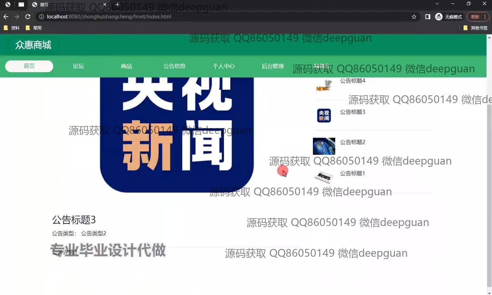
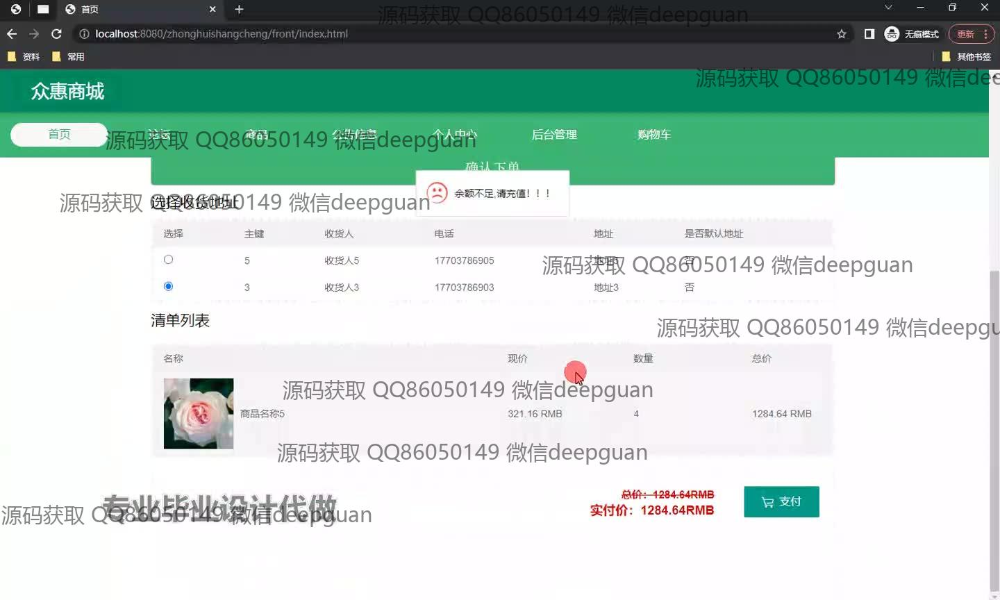
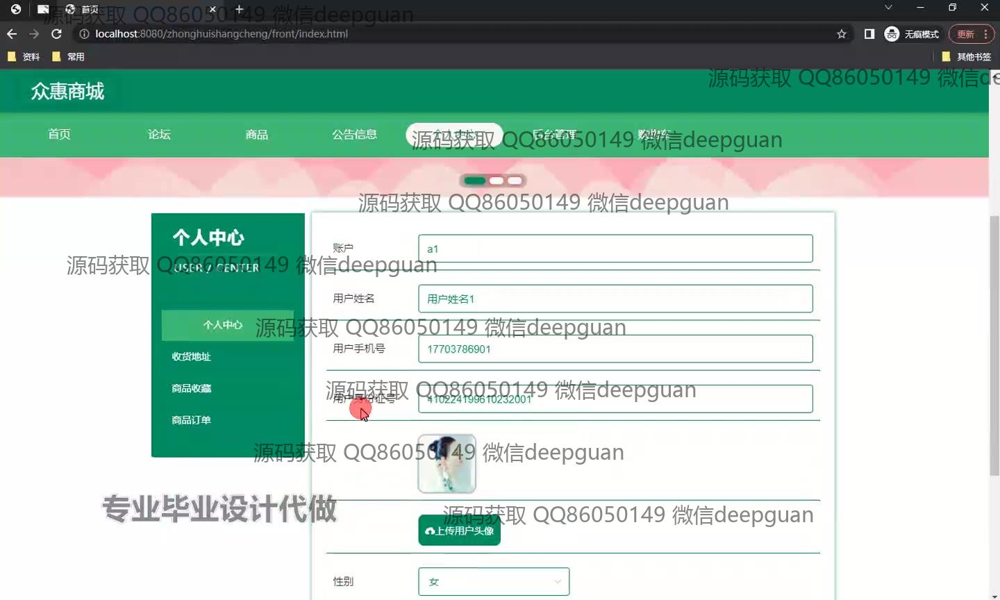
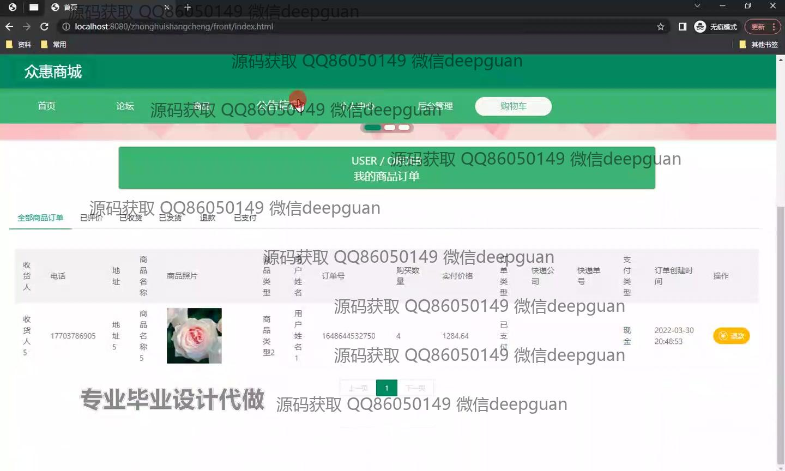
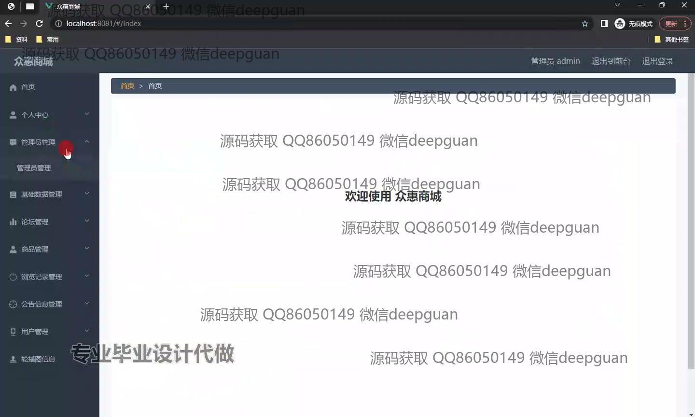
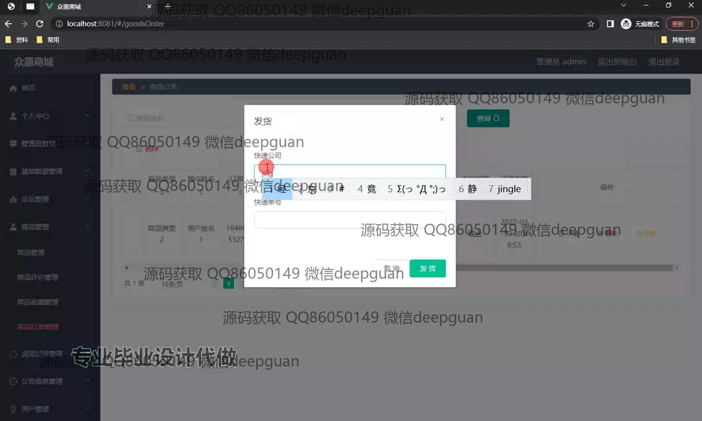
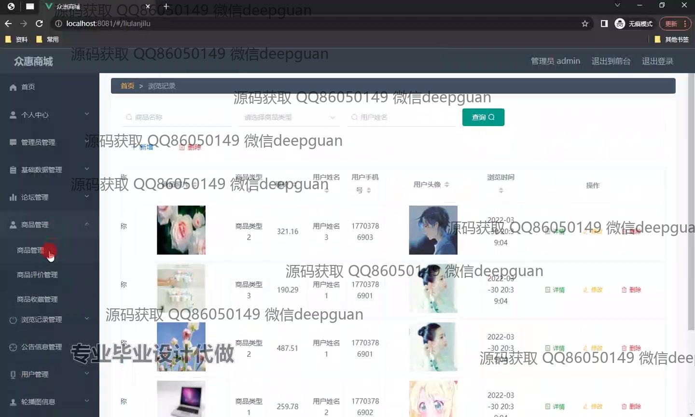
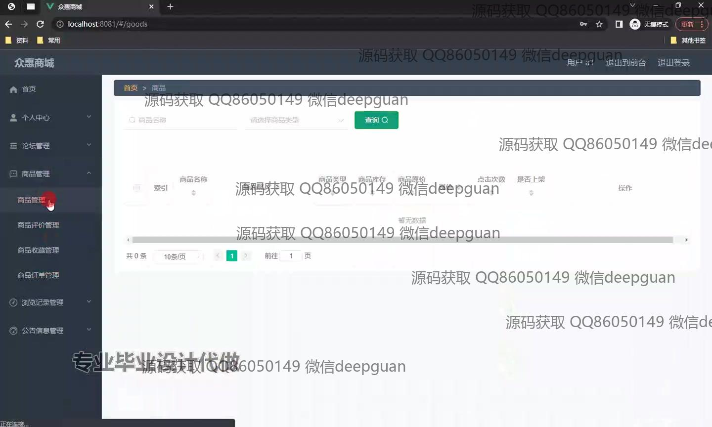
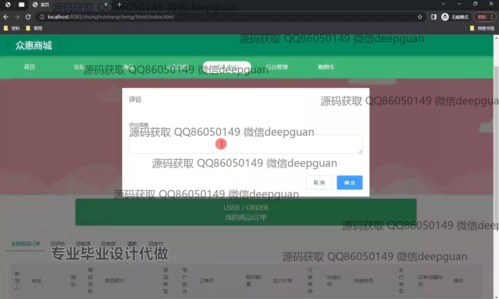
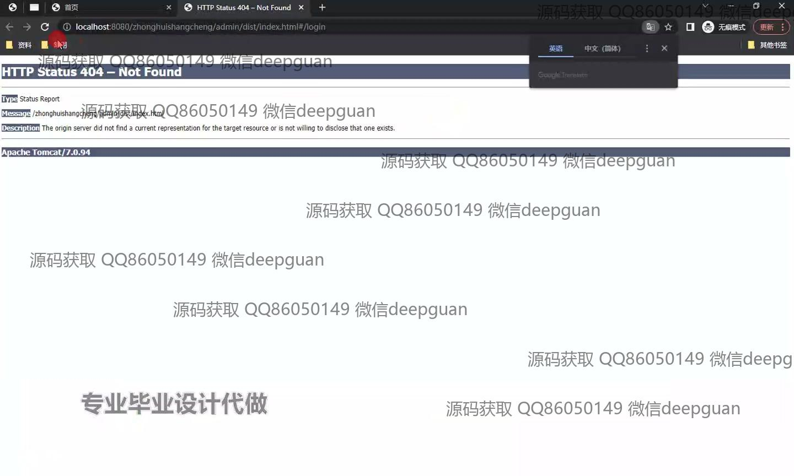
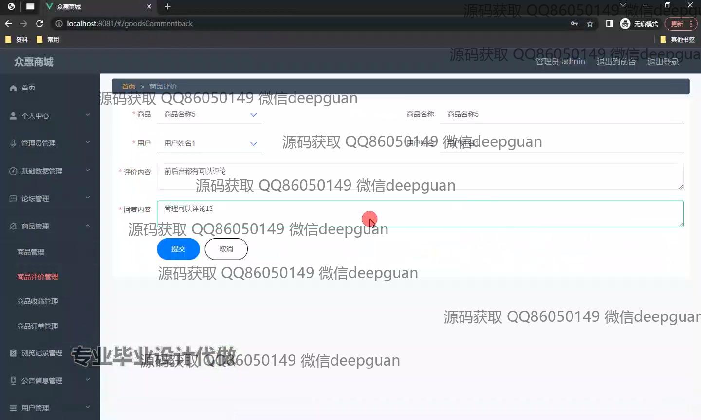
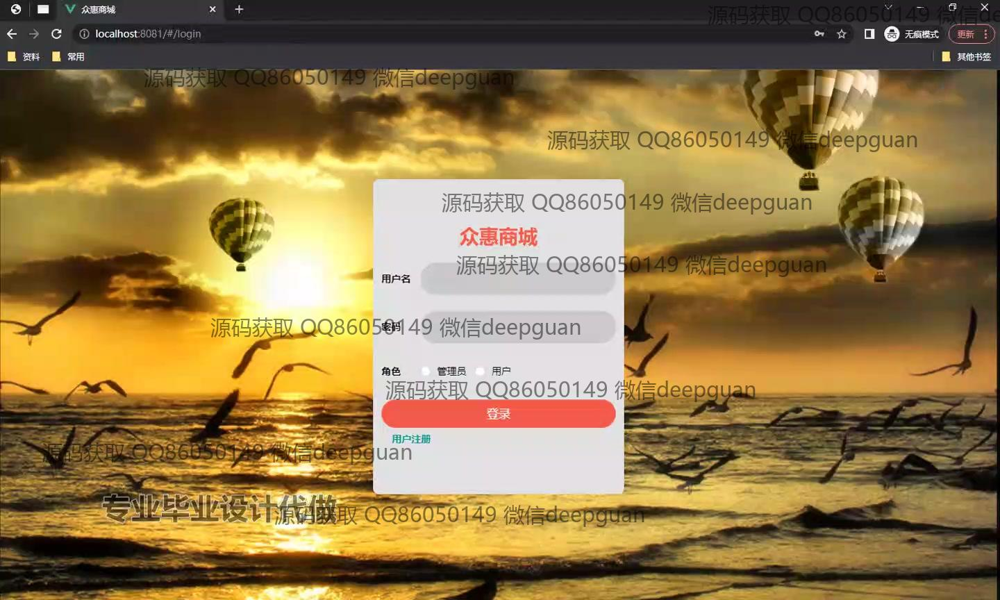

本代码来源于网络,仅供学习参考使用!

